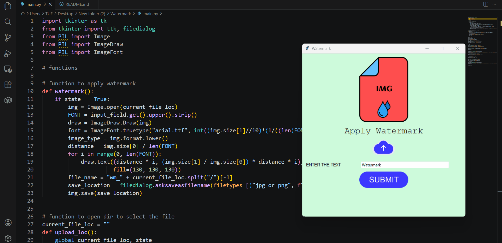

Here’s a polished **GitHub README** for your Watermark Application that makes it look professional, contributor‑friendly, and visually engaging:

---

# 🖼️ Watermark Application

The **Watermark Application** is a simple Python tool that lets you add custom watermarks to your images with ease. Built using **Tkinter** for the graphical user interface (GUI) and **Pillow (PIL)** for image processing, it provides an intuitive interface where users can upload an image, type in a watermark, and save the modified picture. 💻✨

---



## 🚀 Features
- **Interactive GUI** built with Tkinter  
- **Custom watermark text** input field  
- **Dynamic font sizing** based on image dimensions  
- **Preview of selected file name** before processing  
- **Save option** with custom file name and format (JPG/PNG)  
- **Clean and minimal design** with themed background and icons  

---

## 🛠️ Installation

Clone this repository:
```bash
git clone https://github.com/harris8099/Watermark.git
```

Install the required dependencies:
```bash
pip install pillow tkinter
```

Run the application:
```bash
python watermark_app.py
```

---

## 📸 Preview
`https://github.com/user-attachments/assets/1174606c-f57b-4a84-818d-7c688ef5d28d`

---

## 🤝 Contributing
Contributions are welcome!  
If you’d like to add new features (like watermark positioning, transparency, or image batch processing), please fork the repo and submit a pull request.

---

## 🐛 Known Issues
- Watermark placement is currently diagonal and may overlap depending on text length.  
- Font style is fixed to Arial; adding font selection could improve flexibility.  
- Limited support for non‑Latin characters in watermark text.  

---

## 🛣️ Future Roadmap
- Add **watermark positioning options** (top‑left, bottom‑right, center).  
- Support for **transparent watermarks**.  
- Batch processing for multiple images.  
- Font customization (style, size, color).  
- Drag‑and‑drop image upload.  

---